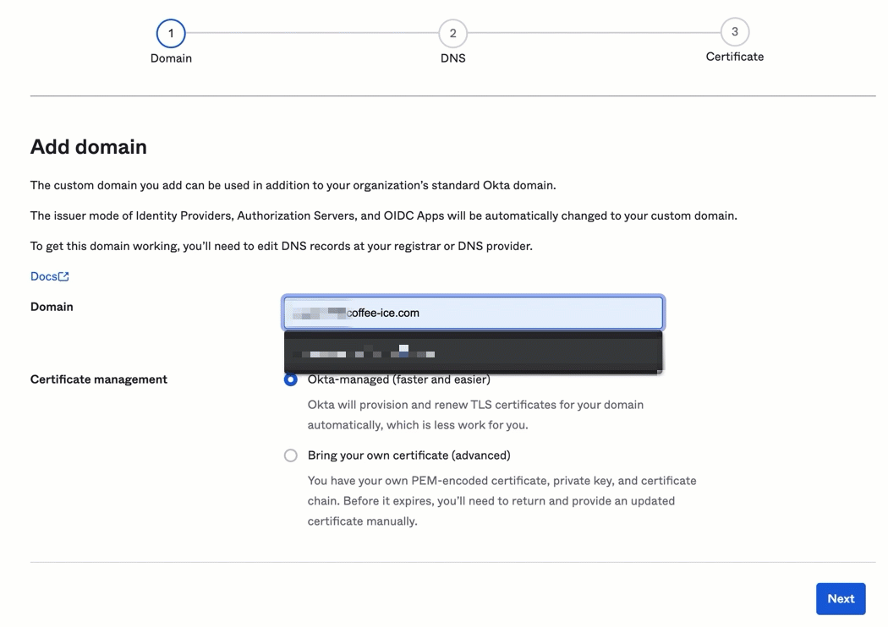
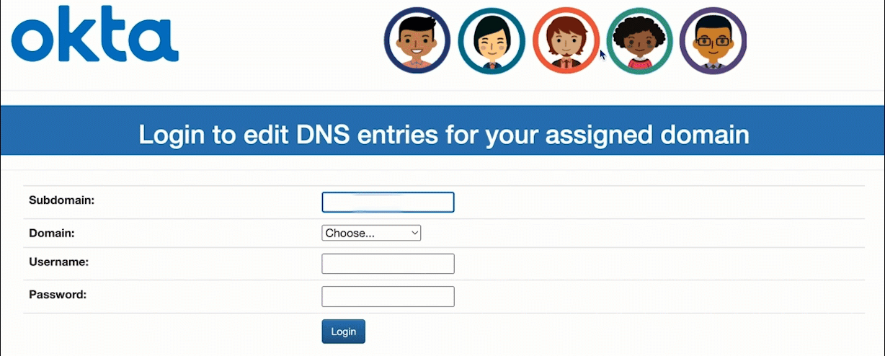
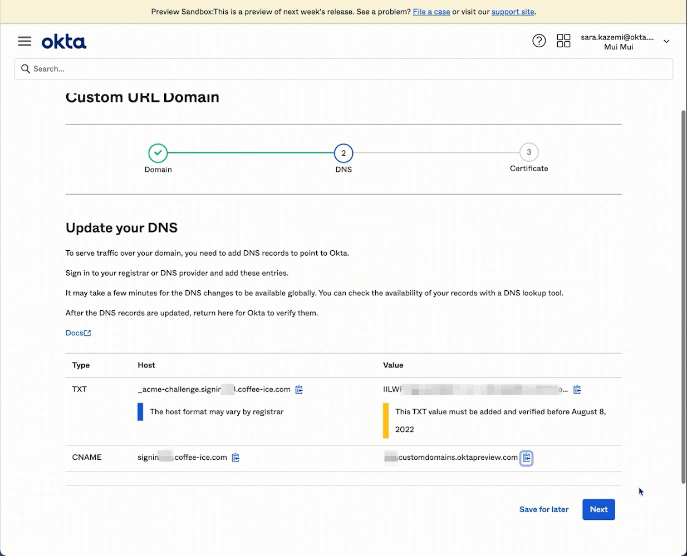
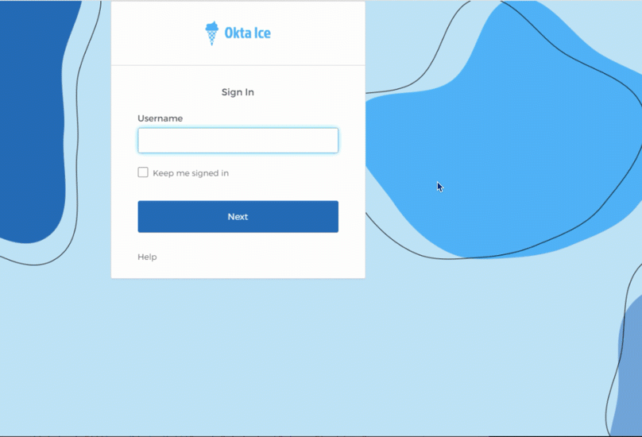
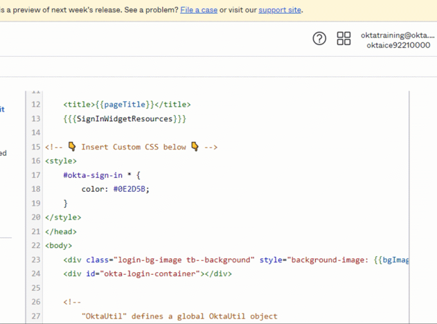
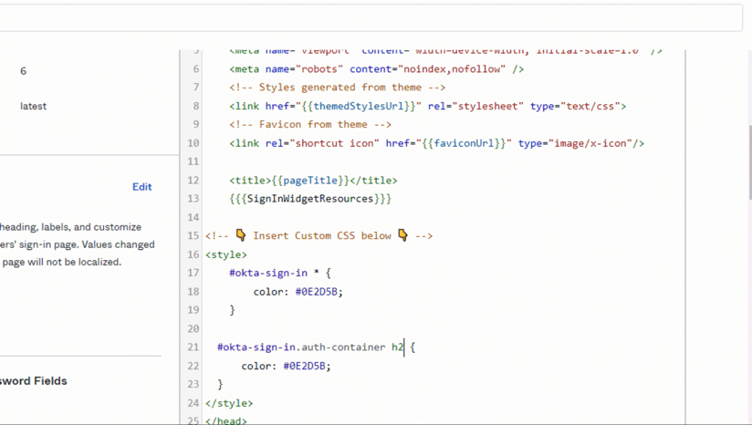
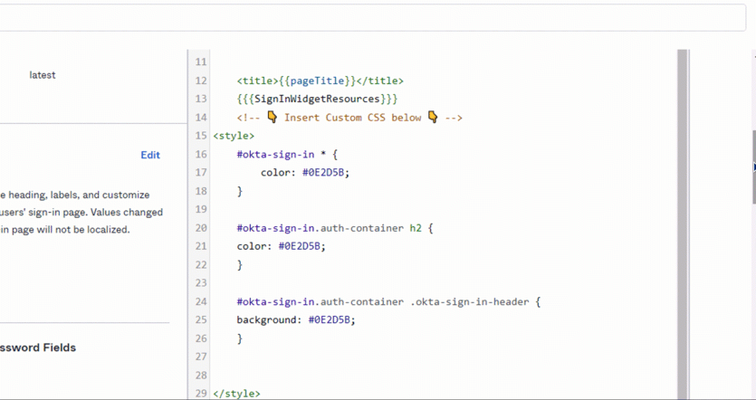
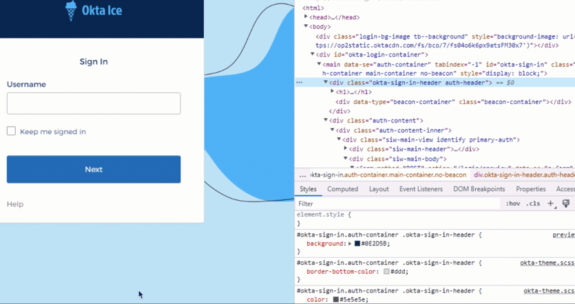
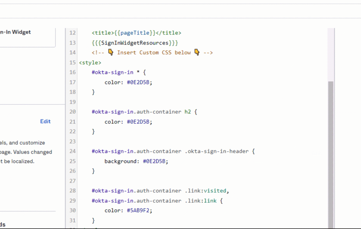

# Okta Customer Identity for Developers Lab Guide

Copyright 2022 Okta, Inc. All Rights Reserved.

## Table of Contents

  - [Lab 1.1: Access Your Okta Org](#lab-11-access-your-okta-org)

  - [Lab 1.2: Create Okta Groups](#lab-12-create-okta-groups)

  - [Lab 1.3: Create Okta Users](#lab-13-create-okta-users)

  - [Lab 1.4: Create Okta Application Integrations](#lab-14-create-an-okta-application-integration)

  - [Lab 2.1: Configure a Custom Domain](#lab-21-configure-a-custom-domain)

  - [Lab 2.2: Customize the Okta Sign-In Page with the Branding UI](#lab-22-customize-the-okta-sign-in-page-with-the-branding-ui)

  - [Lab 2.3: Customize the Okta Sign-In Page Using the Sign-In Page Code Editor](#lab-23-customize-the-okta-sign-in-page-using-the-sign-in-page-code-editor)
  
  - [Lab 3.1: Project Set Up](#lab-31-project-set-up)

  - [Lab 3.2: Configure the Customer Polling App Using the Embedded Widget](#lab-32-configure-the-customer-polling-app-using-the-embedded-widget)

  - [Lab 3.3: Test Web SSO](#lab-33-test-web-sso)

  - [Lab 4.1: Get an API Token and Set Up the Postman Environment](#lab-41-get-an-api-token-and-set-up-the-postman-environment)

  - [Lab 4.2: Create an Okta User Via the Users API](#lab-42-create-an-okta-user-via-the-users-api)

  - [Lab 4.3: Update a User Via the Users API](#lab-43-update-an-okta-user-profile-via-the-users-api)

  - [Lab 5.1 Modify the Default User Profile Requirements](#lab-51-modify-the-default-user-profile-requirements)

  - [Lab 5.2 Enable Self-Service Registration](#lab-52-enable-self-service-registration)

# Lab 1.1: Access Your Okta Org

🎯 **Objective**:    Sign in to your virtual machine and authenticate to your Okta organization.

⏱️ **Duration**:    15 minutes


## Access Your VM

## Access Your Okta Admin Dashboard

1. Launch the Chrome browser.

2. Copy the Okta Org assigned to you (e.g. `https://oktaiceXXX.oktapreview.com`)

3.  On the **Okta Sign In** page, sign in with the credentials assigned to you.

4.  Select a recovery question and enter in a recovery answer.

5.  Click `Create My Account`

## ✅ Checkpoint

At this point, you have access to your lab environment to complete the rest of the labs.

# Lab 1.2: Create Okta Groups

  🎯 **Objective**   Create Okta Groups -- one for Okta Ice Franchisees and one for Okta Ice customers. Create a Group rule for automatically adding certain users to the Customers group.

  🎬 **Scenario**   Franchisees and customers require a distinct groups for application access and access policies.

  ⏱️ **Duration**     15 minutes

## Create a Franchisee Group
1.  Ensure you are logged in as your Okta Super Admin account `oktatraining` and that you are on the `Admin` dashboard.

2.  Navigate to `Directory > Groups`

3.  Click `Add Group`

4.  In the `Name` field, enter `Franchisees`

5. Click `Save`

## Create a Customer Group

1.  Click `Add Group` again.

2.  This time, enter `Customers` in the `Name` field.

3. Click `Save`

## Create a Group Rule for the Customer Group

Now we will create a rule so that any user created that has the `userType` `customer` will automatically be added to the Customer group. This will be helpful when we implement self-service registration for our customers.

1. On the top of the **Groups** page, click the `Rules` tab.

2. Click **Add Rule**

3. Name the rule `Add customer userType to Customers Group`

4. Set the **IF** section to read: IF `User attribute` `userType` `Equals` `customer`

5. In the **THEN Assign to** section, type and select the `Customers` group.

6. Click `Save`

## Activate the Rule

You should now see the `Add customer userType to Customers Group` rule listed on the **Group Rules** page.

Notice, however, that the `Status` is `Inactive`, so we'll need to activate it:

1. Click `Actions`

2. Select `Activate`

3. Confirm the `Status` has changed to `Active`


## ✅ Checkpoint

You now have two Okta Groups that you will use to manage access to applications.

# Lab 1.3 Create Okta Users
  
  🎯 **Objective**:   Create some End User accounts and assign them to Okta Groups for testing configurations.

  🎬 **Scenario**:    We'll need some End Users to test out the Franchisee and Customer experience.

  ⏱️ **Duration**:   10 minutes

## Navigate to the People Directory

1. Ensure you are signed in as your Super Admin account, `oktatraining`.

2. In the Admin Dashboard, select `Directory` > `People`.

## Create and Add a Test User to the Franchisee Group

1. Click the `Add Person` button.
2. Enter the following details:


|**Field**                                  | **Value**                               |
|:-------------------------------------------|:-----------------------------------------|
| First name                                |  `Kay`                                |
| Last name                                 |  `West`                               |
| Username                                  |  `kay.west@oktaice.com`                 |
| Primary email                             |  `kay.west@oktaice.com`                 |
| Group | `Franchisees`|
|Activation | `Activate now`|
| I will set the password                   |`CHECKED`                       |
| Enter password                            |  `Tra!nme4321`                        |
| User must change password on first login  |  `UNCHECKED`    |


Last, click the `Save and Add Another` button.

## Create and Add a Test User to the Customer Group
Enter the following details:


|**Field**                                  | **Value**                               |
|:-------------------------------------------|:-----------------------------------------|
| First name                                |  `Soraya`                                |
| Last name                                 |  `Esfeh`                               |
| Username                                  |  `soraya.esfeh@oktaice.com`                 |
| Primary email                             |  `soraya.esfeh@oktaice.com`                 |
| Groups | `Customers`|
|Activation | `Activate now`|
| I will set the password                   |`CHECKED`                       |
| Enter password                            |  `Tra!nme4321`                        |
| User must change password on first login  |  `UNCHECKED`    |


Last, click the `Save` button.

## ✅ Checkpoint

You now have a test user in the Franchisee group and a test user in the Customer group.

# Lab 1.4: Create Okta Application Integrations

 🎯 **Objective**    Create Okta application integrations for two existing applications. Assign one application to the Customers group and assign one application to the Franchisee group.

  🎬 **Scenario**     Customers and Franchisees require access to a different set of applications.

  ⏱️ **Duration**    15 minutes

## Navigate to Applications

1. Ensure you are logged in to the Admin Dashboard as `oktatraining`

2. In the Admin menu, navigate to `Applications` > `Applications`

## Create an Application Integration for the Rewards App

The Rewards app is an existing application in this project. We're going to set up an integration in Okta so our customers can access this application. We'll talk about the code implementation in subsequent modules.

1. Click `Create App Integration`

2. Select the `OIDC - OpenID Connect` radio button.

3. Select the `Single-Page Application` radio button.

4. Name this application `Customer Rewards`

5. In the **Sign-in redirect URIs** field, enter `http://localhost:8080/redirect/rewards.html`

6. Under **Assignments** click the radio button option for `Limit access to select groups`

7. Type in and select `Customers`

8. Click `Save`

## Configure the Rewards Application `appClientID`

The Rewards application makes use of Okta's AuthJS SDK, which we will learn about more in the next module. For now, you'll simply need to configure the ClientID and Okta Org URL to make this integration work.

1. Copy the `Client ID` that was displayed after you saved your integration. 

2. Paste the `Client ID` into the `appClientID` variable above.

## Configure the Rewards Application `baseOktaURL`

1. Change the `baseOktaURL` to match your assigned Okta org URL.

2. Click here to `Save` your `rewards.html` file.

## Create an Application Integration for the CRM App

We will complete the same steps for the Franchisee app. The one difference is we will assign this app to the Franchisee group. See how many steps you can complete without referring to the instructions!

1. Click `← Back to Applications`

2. Click `Create App Integration`

3. Select the `OIDC - OpenID Connect` radio button.

4. Select the `Single-Page Application` radio button.

5. Name this application `Franchisee CRM`

6. In the **Sign-in redirect URIs** field, enter `http://localhost:8080/redirect/crm.html`

7. Under **Assignments** click the radio button option for `Limit access to select groups`

8. Type in and select `Franchisees`

9. Click `Save`

## Configure the CRM Application `appClientID`

1. Copy the `Client ID` that was displayed after you saved your integration. 

2. Paste the `Client ID` into the `appClientID` variable above.

## Configure the CRM Application `baseOktaURL`

1. Change the `baseOktaURL` to match your assigned Okta org URL.

2. Save your `crm.html` file.

3. **Log out** of your Okta org since you will be logging in as a different user in the subsequent steps.

## Start the Web Server

1. Open a new terminal in VSCode 

2. Notice that the terminal automatically opens to the project directory.

3. Issue the command `python -m http.server 8080`

## Test out the Rewards App

1. In Chrome, visit http://localhost:8080

2. Click the `Rewards App (Redirect)` link. You should be redirected to Okta to sign in.

3. Log in as `soraya.esfeh@oktaice.com`/`Tra!nme4321`

You should be redirected back to the Rewards app and you should see some information printed to the page that we will discuss later. For now you can see Soraya's email address at the top as well as your app's Client ID at the bottom.

## Try to Access the CRM App

1. Still logged in as Soraya, click `Return to Portal`

2. Click on `CRM App (Redirect)`

3. The CRM application does not load because Soraya is not authorized to access this application. The CRM app is only assigned to users in the `Franchisees` group and she is not a member of that group.

4. Click the `Close Okta Session` button.

5. Click `Return to Portal`

## Log in as a Franchisee Partner

Now we're going to log in as Kay West, who is a member of the Franchisees group.

1. Click on `Rewards App (Redirect)`

2. Enter `kay.west@oktaice.com` as the login and click `Next`

3. Notice that this user did not have an existing session with Okta before trying to access an application that is not assigned to them. In this case, we are not even prompted for a password to authenticate and we are told that the application is not assigned to the user. The user still does not have a session.

4. Click `Return to Portal`

5. Click on `CRM App (Redirect)` 

6. Log in as `kay.west@oktaice.com`/`Tra!nme4321`

You should be redirected back to the CRM app and you should see see Kay's email address at the top as well as your app's Client ID at the bottom. 

## End Your Okta Session and Shut Down the Web Server

1. Click the `Close Okta Session` button.

2. In the terminal window in VSCode where you launched the web server, press `CTRL`+`C` to stop the web server. 

# Lab 2.1 Configure a Custom Domain

🎯 **Objective:**   Configure a custom domain in Okta and configure your DNS to support the custom URL. 

🎬 **Scenario**    Continuing with the white label experience, Okta Ice wants to change the Okta URL to its own domain. In this lab, you will configure Okta and your DNS to change the Okta URL end-users will use. 

⏱️ **Duration:**     20 minutes

## Configure a Subdomain

1. Log in to your Okta org as `oktatraining`.
2.  Click `Customizations` > `Domain`.
3.  Click `Edit` and then click the `Get started` button.

In the next step, you will find your assigned fully-qualifed domain for this class, which you will enter on this page.

## Find Your Fully-Qualified Subdomain 

To locate the fully-qualified domain name assigned to you for this class:

1. Open the credentials spreadsheet

2.  Navigate to the `CLOUDFLARE` section

3.  Locate the `SUBDOMAIN` and `DOMAIN` next to your name in the list

4.  Your fully-qualified domain is `<SUBDOMAIN>.<DOMAIN>`, e.g. `signin###.coffee-ice.com`.

5.  Enter this fully-qualified domain name into the `Domain` field in Okta.

6.  Under **Certificate management**, ensure Okta-managed is selected.

7.  Click `Next`.

Okta will now provide you with a `TXT` value and a `CNAME` value, which we will use in the next step to verify that we own this domain.


## Log In to the DNS Configuration Tool
In a new tab, navigate to our DNS configuration tool at [https://oktaice.store/ciam/](https://oktaice.store/ciam/) and log in with the following information (replacing ### with your assigned subdomain number)

| Field Name | Value |
|-----------|--------:|
| Subdomain | `signin###` |
| Domain | `coffee-ice.com` |
| Username | `oktatraining` |
| Password | `Tra!nme4321` |


When you log in, verify that you have logged in to modify the DNS entries for the correct subdomain and domain. 

There should not be any entries. If there are, delete them.



1.  Click `Add Entry`

2.  In the `Type` section, choose `TXT`

3.  Switch back to your Okta tab

4.  Copy the **TXT entry name** (e.g.,`_acme-challenge.signin###.coffee-ice.com`)

5.  Switch back to the DNS configuration tool

6.  Paste this text into the `Name` field

7.  Switch back to your Okta tab

8.  Copy the **TXT entry content** (a unique value generated by Okta)

9.  Switch back to the DNS configuration tool

10.  Paste this text into the `Content` field

11. Click `Add`


## Add the CNAME Entry

1.  In the `Type` section, choose `CNAME`
2.  Switch back to your Okta tab
3. Copy the **CNAME entry name** (e.g., `signin###.coffee-ice.com`)
4. Switch back to the DNS configuration tool
5. Paste this text into the `Name` field
6. Switch back to your Okta tab
7. Copy the **TXT entry content** (Your Okta org URL)
8. Switch back to the DNS configuration tool
9. Paste this text into the `Content` field
10. Click `Add`
11. Click `Cancel`
12. You should now see the two entries you added
13.  You can now log out of the DNS configuration tool and close the tab


## Issue an Okta-Managed Certificate

Navigate back to the Okta tab and click `Next`. Okta will take a moment to verify the DNS 01 challenge:

- If verification fails, go back and check that you entered both the TXT and CNAME records correctly

- If verification is successful, Okta will issue a TLS certificate for your custom domain. Click `Finish`.



To verify your custom domain, you can open an incognito window and visit `https://<SUBDOMAIN>.<DOMAIN>`. You should see the Okta Sign In page.

However, since we just configured these DNS records, old records may still be cached by DNS providers or your local machine. If your custom domain isn't resolving, you can [flush the DNS cache](https://support.opendns.com/hc/en-us/articles/227987067-How-to-refresh-the-DNS-cache-on-OpenDNS-Global-Resolvers-).

📝 **Note:** The custom domain is valid for the User Home console and the Self-Service screens. The custom domain is not used in the admin console.

## ✅ Checkpoint

At this point, you have done the configuration that will allow you to access your Okta org with your custom domain. Setting up a custom domain also allows you to customize the Okta-hosted SIW.

# Lab 2.2: Customize the Okta Sign-In Page With the Branding UI
🎯 **Objective:**  Customize the Okta Sign-In Page with Okta Ice branding.    

🎬 **Scenario**    Okta Ice needs a branded Sign-In Page for a complete white label experience.

⏱️ **Duration:**   20 minutes

⚠️ **Prerequisite:** Lab 2-1

## Access the Sign-in Page Code Editor

1.  If you aren't already, sign in to your Okta org as your Super Admin acount `oktatraining`

2.  From the Admin dashboard, click `Customizations` > `Sign-in page code editor`

You will see the default Sign-in page code, which we'll walk through next.

## The Default Sign-in Page Code

The code from the default Okta-hosted sign-in Page has been copied here so we can explore it more in depth. You can customize the Okta-hosted sign-in page, not only by modifying the code in the Sign-in Page Code Editor, but by configuring settings in Okta's Theme Builder. Your Okta org must have Theme Builder enabled to use these macros in the Sign In Page code editor.

```html
<!DOCTYPE html PUBLIC "-//W3C//DTD HTML 4.01//EN" "http://www.w3.org/TR/html4/strict.dtd">
<html>
<head>
    <meta http-equiv="Content-Type" content="text/html; charset=UTF-8">
    <meta name="viewport" content="width=device-width, initial-scale=1.0" />
    <meta name="robots" content="noindex,nofollow" />
    <!-- Styles generated from theme -->
    <link href="{{themedStylesUrl}}" rel="stylesheet" type="text/css">
    <!-- Favicon from theme -->
    <link rel="shortcut icon" href="{{faviconUrl}}" type="image/x-icon"/>

    <title>{{pageTitle}}</title>
    {{{SignInWidgetResources}}}
</head>
<body>
    <div class="login-bg-image tb--background" style="background-image: {{bgImageUrl}}"></div>
    <div id="okta-login-container"></div>

    <!--
        "OktaUtil" defines a global OktaUtil object
        that contains methods used to complete the Okta login flow.
     -->
    {{{OktaUtil}}}

    <script type="text/javascript">
        // "config" object contains default widget configuration
        // with any custom overrides defined in your admin settings.
        var config = OktaUtil.getSignInWidgetConfig();

        // Render the Okta Sign-In Widget
        var oktaSignIn = new OktaSignIn(config);
        oktaSignIn.renderEl({ el: '#okta-login-container' },
            OktaUtil.completeLogin,
            function(error) {
                // Logs errors that occur when configuring the widget.
                // Remove or replace this with your own custom error handler.
                console.log(error.message, error);
            }
        );
    </script>
</body>
</html>
```

## Examine the Sign-in Page Macros

Throughout the default Sign-in Page code, you will see entries surrounded by curly braces `{{}}` such as the one highlighted here. These are called **macros**. Macros generate code that can be applied in the Sign-In Page code editor. The data these macros depend upon are configurable in Okta's Theme Builder.  

## Sign-in Page Macro: `themedStylesUrl`

The macro `{{themedStylesUrl}}` generates a CSS file that defines the primary and secondary colors for this page.

## Sign-in Page Macro: `faviconUrl`

The `{{faviconUrl}}` macro inserts the URL for the favicon. The favicon can be changed in the Okta Branding UI.

## Sign-in Page Macro: `pageTitle`

The `{{pageTitle}}` macro inserts the page title set in the Okta Branding UI.

## Sign-in Page Macro: `SignInWidgetResource`

The `SignInWidgetResource` inserts the JavaScript and CSS files required to use the Okta Sign-In Widget.

## Sign-in Page Macro: `bgImageUrl`

The `{{bgImageUrl}}` macro inserts the URL to the background image configured in your Okta organization. You can upload and set this background image in the Okta Branding UI.

## Sign-in Page Macro: `OktaUtil`

Defines a global `OktaUtil` JavaScript object that contains methods used to complete the Okta sign-in flow. When an application uses the Okta-hosted sign-in page to sign a user in, information (called request context) is available about the target application and the request.

## Sign-In Widget JavaScript
Next we'll walk through this bit of JavaScript that is responsible for rendering the Okta Sign-In Widget (SIW) on the sign in page. The SIW itself is a JavaScript library.

## SIW JavaScript: `config` Variable

The `config` variable gets the configuration of the Sign-In Widget, This configuration, at minimum, defines the `issuer`, `clientId`, and `redirectUri`

## SIW JavaScript: Creating an `OktaSignIn` Object

This line instantiates a new `OktaSignIn` object with the configurations we have stored in `config`. This will be used to render the SIW in the following lines.


## SIW JavaScript: Rendering the Okta SIW
The `OktaSignIn` object is then used to call the `renderEl()` funtion to render the SIW. Let's take a look at the method signature to break down what's being passed to this method:

```
 renderEl(renderOptions: RenderOptions, successFn?: RenderSuccessCallback, errorFn?: RenderErrorCallback): Promise<RenderResult> 
```

### Render Options
This parameter takes render options for the SIW in the form of JSON data. It must include the `el` or `$el` property.
In this case, we're passing a CSS class `#okta-login-container`, which will render the SIW in a `div` of this class.

### Success Callback
This parameter expects a function, which gets called upon successfully configuring and rendering the widget.

### Error Callback
This paramater expects a function, which gets called if there is an error when configuring and rendering the widget. Currently, we are simply logging the error to console.


## Access the Okta Branding UI
Before we make any changes to the default Sign-in Page code, let's see what we can customize the SIW without touching any code at all. We'll do this with Okta's Theme Builder.

Navigate to `Customize` > `Branding`

Under the `Theme` section, you can define:
- Primary and Secondary colors
- Logo
- Favicon
- Background

## Customize the Primary and Secondary Colors

In the default Sign-in Page code, the primary color is applied to the `Sign In` button and the secondary color is applied to the background color of the Sign-in page.

Change the Primary color to `#2d75bb`

Change the Secondary color to `#c7e5f5`

## Customize the Logo

Next, we're going to upload a custom logo to be displayed at the top of the SIW. 

1. Click the pencil icon next to the `Logo` item
2. Select `Upload new image`
3. Open `C:\ClassFiles\02-customizing-okta-hosted-siw\img\ice-logo.png`


## Customize the Favicon

Next, we're going to upload a custom favicon.

1. Click the pencil icon next to the `Favicon` item
2. Select `Upload new image`
3. Open `C:\ClassFiles\02-customizing-okta-hosted-siw\img\favicon.png`


## Customize the Background Image

Next, we're going to upload a custom background image. 


1. Click the pencil icon next to the `Background` item
2. Select `Upload new image`
3. Open `C:\ClassFiles\okta-hosted-siw\img\ice-cream-bg.png`


Click `Save Changes`

Now that we have customized our theme, we need to apply it to our Sign-in page. 

1. In the section labeled `Pages`, click `Edit` on the item labelled `Okta-hosted Sign-In Page`
2. Click the style labeled `Solid background` and observe the change in the preview panel. This style uses our custom logo, applies the primary color to the `Sign In` button, and uses the secondary color as the solid background for the page.
3. Click the style labelled `Image background` and observe the change in the preview panel. This style is the same as the above, but it applies our image background to the page.
4. Click `Save and Publish`


## Preview the Sign-In Page

We're going to navigate back to the Sign-in page code editor to preview the Sign In Page and add some additional customizations.

**Leave this page open for the next lab**

1. Navigate to `Customizations` > `Sign-in page code editor`
2. Click `Preview`

You should now see a customized Sign-in Page, which we've achieved without changing any code.

**Leave this page open for the next lab.**

## ✅  Checkpoint

We saw how we could customize the SIW without touching the Sign-In Page code through Okta's Branding UI. For some use cases, this level of customization is enough! For other use cases, we might want to customize the Sign-In Page beyond what Okta's Branding UI can offer. In the next lab, we use the integrated Sign-In Page code editor to achieve this.

# Lab 2.3: Customize the Okta Sign-In Page Using the Sign-In Page Code Editor

🎯 **Objective:**  Further customize the Sign-In Page with the Sign-In Page Code Editor.

🎬 **Scenario**    Okta Ice wants to further customize the Sign-In Page beyond what is offered by the Okta Branding UI.

⏱️ **Duration:**   20 minutes

⚠️ **Prerequisite:** Lab 2-1 and 2-2

### Note about this lab:
In this lab, you will be adding code to the default Okta Sign-In Page html. For the best learning experience, you are highly encouraged to type the code in manually. 

To provide a differentiated experience for learners of all types, we've included an `Insert Code` link after each coding segment. This inserts the code to the correct line(s) automatically. After you insert the code, you will still have to click `Next` to advance to the next lab step.


## Inspect the Sign-In Page Elements

You should still have the Sign-In Page preview open from the last lab. If you do not have this page open, ensure you are signed in as your `oktatraining` and:

1. Navigate to `Customizations` > `Sign-in page code editor`
2. Click `Preview`

On the preview of your Sign-In Page, right click on the page and select `Inspect` and ensure that you are viewing the `Elements` tab and the `Style` sub-tab.


Alternatively, you can use the keyboard shortcut `SHIFT` + `CONTROL` + `C`

## Inspect the Form Label Element

One of the elements we may want to customize, is the font color of the text in the SIW. Let's inspect the `Username` form label in the SIW by right-clicking on the element and selecting `Inspect`

Notice that this updates what we see in `Elements` and `Style` and we can see that the CSS selector that defines the text color for this element is `#okta-sign-in *`


## Update the Font Color of General Text in the SIW

We now know that the text color of the general text elements in the SIW is defined by the `#okta-sign-in *` selector so now we can add some embedded CSS to the Sign-In Page code. We'll make changes here first before checking the changes in the embedded Sign-In Page Code Editor.

Notice that this lab step automatically points to a particular line in the HTML code. This is where you will be adding some embedded CSS to change the font color of the general text in the SIW to a pink hue that matches the Okta Ice logo. 

Type in the following embedded CSS **or** use the `Insert Code` link to add it automatically:

```html
<style>
    #okta-sign-in * {
        color: #0E2D5B;
    }
</style>
```

## Preview Font Color Change in the Sign-In Page Code Editor

Notice that this step has automatically highlighted the entire HTML file for you. 

1. Right click into the code frame and select `Copy`.
2. Go back to your Okta Sign-In Page Code Editor tab in Chrome.
3. Highlight the contents of the `HTML` box.
4. Right click and select `Paste` to replace the code with the contents of your clipboard.
5. Scroll up and verify that your embedded CSS now appears in the code.
6. Click the `Preview` button and observe the font color change.




## Inspect the SIW Form Header

Notice that our font color change was not applied to the `Sign In` header on above the form in the SIW. Let's inspect the Sign-In Page code again. In your latest preview of the Sign-In Page, on the `Sign-In` text and select `Inspect`

When we do this, we see that the font color for this element is specified in the selector `#okta-sign-in.auth-container h2`


## Update the SIW Form Header Font Color

We're going to add some more embedded CSS to change the color of the form header to match the Okta Ice dark blue of the other text in the SIW. 

Notice that this step highlights the line where you should be adding this code, which is just under the CSS we added in the previous step.

As always, we recommend manually typing in the following code segment, but you may alternatively use the `Insert Code` link.

```css
#okta-sign-in.auth-container h2 {
    color: #E4AACD;
}
```
## Preview Font Color Change of Form Header

Notice that this step has automatically highlighted the entire HTML file for you. 

1. Right click into the code frame and select `Copy`
2. Go back to your Okta Sign-In Page Code Editor tab in Chrome.
3. Highlight the contents of the `HTML` box.
4. Right click and select `Paste` to replace the code with the contents of your clipboard.
5. Scroll up and verify that your embedded CSS now appears in the code.
6. Click the `Preview` button and observe that the font color of the form header now matches the other text in the SIW.



## Inspect the SIW Main Container

Next, let's find out what selector we can access to change the background color of the SIW. In your latest preview of the Sign-In Page, right click into the body of the SIW. Here find the selector `#okta-sign-in.auth-container.main-container` that we can use for this purpose.


## Update the SIW Header Background Color

Let's change the background color of the SIW header to a dark blue. We'll use the `#okta-sign-in.auth-container .okta-sign-in-header` selector to do this by adding to our embedded CSS code:

```css
#okta-sign-in.auth-container .okta-sign-in-header {
    background: #0E2D5B;
}
```

## Preview the SIW Background Color Change


Notice that this step has automatically highlighted the entire HTML file for you. 

1. Right click into the code frame and select `Copy`
2. Go back to your Okta Sign-In Page Code Editor tab in Chrome.
3. Highlight the contents of the `HTML` box.
4. Right click and select `Paste` to replace the code with the contents of your clipboard.
5. Scroll up and verify that your embedded CSS now appears in the code.
6. Click the `Preview` button and observe that the background color of the SIW has changed.



## Inspect Link Element

Let's change the color of the `Help` so it stands out a bit more and matches our branding. In your latest preview of the Sign-In Page, right click on the `Help` link at the bottom of the SIW and select `Inspect`

Here we find the relevant selectors: `#okta-sign-in.auth-container .link` and `#okta-sign-in.auth-container .link::visited`



## Update the SIW Link Color

We're going to add to our embedded CSS at the indicated line of the HTML file. Not only are we going to define the link color, but we'll define the color for a visited link as well. We'll define both as a bright blue:

```css
  #okta-sign-in.auth-container .link:visited, 
  #okta-sign-in.auth-container .link {
    color: #5AB9F2;
  }
```

## Preview the Link Color Change


Notice that this step has automatically highlighted the entire HTML file for you. 

1. Right click into the code frame and select `Copy`
2. Go back to your Okta Sign-In Page Code Editor tab in Chrome.
3. Highlight the contents of the `HTML` box.
4. Right click and select `Paste` to replace the code with the contents of your clipboard.
5. Scroll up and verify that your embedded CSS now appears in the code.
6. Click the `Preview` button and observe that the color of the `Help` link in the SIW has changed to white.



## Save and Publish Changes

If there's time remaining, feel free to continue tinkering and finding out what else you can customize here. When you're done, click the `Save and Publish` button in the Sign-In Page Code Editor.

## ✅ Checkpoint

At this point, you've investigated additional customizations you can make to the Sign-In Page by using the embedded Sign-In Page Code Editor. 

# Lab 3.1 Project Set Up

🎯 Objective: In order to have working copies of our previously configured redirect apps in our portal, we'll need to copy them to this workspace. This will be necessary to see how SSO works as we configure additional applications in the portal.

⏱️ Duration: 1 min

⚠️ Prerequisite: Lab 1.4

## Copy Redirect Applications 

Click here to copy the `redirect` directory to this workspace.

# Lab 3.2: Configure the Customer Polling App Using the Embedded Widget

🎯 Objective: Create an an Okta application integration and deploy authentication using the embedded Sign-In Widget.

⏱️ Duration: 15 min


## Enable Cross-Origin Resource Sharing (CORS)

In Okta, **CORS** allows JavaScript hosted on your website to make a request using an
`XMLHttpRequest` to the Okta API. Every website origin must be explicitly permitted as a **Trusted Origin** in your Okta org. 

1. Ensure you are logged in to the Admin Dashboard as `oktatraining`

2. In the Admin menu, navigate to `Security` > `API`

3. Click on the `Trusted Origins`  tab.

4. Click the `Add Origin` button

5. Enter `Okta Ice Portal` into the **Origin name** field.

6. Enter `http://localhost:8080` into the **Origin URL** field.

7. Under **Choose Type**, select `Cross-Origin Resource Sharing (CORS)` 

6. Click `Save`

The Polling app is an existing application in this project. We're going to set up an integration in Okta so our customers can access this application. 

1. In the Admin menu, navigate to `Applications` > `Applications`

2. Click `Create App Integration`

3. Select the `OIDC - OpenID Connect` radio button.

4. Select the `Single-Page Application` radio button.

5. Name this application `Customer Polling`

6. Under **Grant Type** select both `Authorization Code` and `Interaction Code`. 

7. In the **Sign-in redirect URIs** field, enter `http://localhost:8080/embedded/polling.html`

8. Under **Assignments** click the radio button option for `Limit access to select groups`

9. Type in and select `Customers`

10. Click `Save`


## Configure the Polling Application `appClientID`

1. Copy the `Client ID` that was displayed after you saved your integration. 

2. Paste the `Client ID` into the `appClientID` variable above.

## Configure the Polling Application `baseOktaURL`

1. Change the `baseOktaURL` to match your assigned Okta org URL.

2. Click here to `Save` your `polling.html` file.

## Embed the Sign-In Widget

The Polling application imports Okta's Sign In Widget JavaScript library via CDN. Embedding tne Sign In Widget directly to the page allows for full customization.

## ✅ Checkpoint

At this point, you have configured an application using the Embedded Sign-In Widget model of deploying authentication.

# Lab 3.3 Test Web SSO

🎯 Objective: Now that we have deployed authentication on two applications assigned to the Customers group, we can test out web SSO.

⏱️ Duration: 10 min

## Log Out of Okta

1. If you are still logged in on your Okta org, log out.

## Start the Web Server

1. Open a new terminal in VSCode 

2. Notice that the terminal automatically opens to the project directory.

3. Issue the command `python -m http.server 8080`

## Test the Polling App

1. In Chrome, visit http://localhost:8080

2. Click the `Polling App (Embedded Widget)` link. 

3. Notice that you are not redirected to Okta for authentication. Instead, the Sign-In Widget loads on the page of your website.

4. Log in as `soraya.esfeh@oktaice.com`/`Tra!nme4321`

You should now see the ID Token (which is formatted as a JSON web token or **JWT**) value and its claims, including:

- `sub` (subject of the JWT): Soraya's Okta User ID
- `name`: Soraya's name
- `email`: Soray's email address
- `ver`: Okta API version
- `iss` (issuer of the JWT): The URL of your Okta Authorization server
- `aud` (audience): Your app's Client ID
- `iat` (issued at time): Time the JWT was issued. Expressed in Unix time.
- `exp` (expiration time): Time the JWT expires. Expressed in Unix time.
- `jti` (JWT ID): Unique identifier used to prevent the JWT from being replayed

## Test the Rewards App

1. Click on `Return to Portal`

2. Click the `Rewards App (Redirect)` link.

3. Notice that you are not prompted to authenticate again as you have an existing session. 

You should see the ID Token value and its claims. Much of this content is the same as you saw on the Polling App. However, notice that the `jti` (JWT ID) and the `aud` (audience) are different. You should now see that the `aud` is this Client ID of the Rewards app.

# Lab 4.1: Get an API token and set up the Postman Environment

🎯 Objective: Create an Okta service account for administrative tasks and associations with API tokens. Set up the Postman environment to make API requests to Okta.

⏱️ Duration: 15 min

## Create an Okta Service Account

1. Ensure you are signed in as your Super Admin account, `oktatraining`.

2. In the Admin Dashboard, select `Directory` > `People`.

3. Click the `Add Person` button.

4. Enter the following details:


|**Field**                                  | **Value**                               |
|:-------------------------------------------|:-----------------------------------------|
| First name                                |  `Okta`                                |
| Last name                                 |  `Service`                               |
| Username                                  |  `okta.service@oktaice.com`                 |
| Primary email                             |  `okta.service@oktaice.com`                 |
|Activation | `Activate now`|
| I will set the password                   |`CHECKED`                       |
| Enter password                            |  `Tra!nme4321`                        |
| User must change password on first login  |  `UNCHECKED`    |

Last, click the `Save` button.

## Assign Administrator Permissions

1.	Navigate to `Security` > `Administrators`

2.	Click `Add Administrator`

3. In the `Admin` field, type and select the user `Okta Service`

4.	In the `Role` field, select `Super Administrator`

5.	Click `Save Changes`

## Sign In to Service Account

1. Log out of the **oktatraining** account.

2. Log back in with the credentials: `okta.service@oktaice.com` / `Tra!nme4321`

3. Click on the `Admin` button.

## Create an API Token

1.	Ensure you are still logged in to the Admin Dashboard as **Okta Service**

2.	Navigate to `Security` > `API`.

3.	On the `Tokens` tab, click `Create Token`.

4.	Enter `Postman` as the token name and click `Create Token`.

5.	A token value is generated and displayed in a popup modal.
Copy this value by clicking the clipboard button.

6. Paste the value in the text file here.

7. Click here to save the text file.

## Import the Postman Environment

1.	In the VM, launch the Postman app (an orange circular icon).

2.	Click the `Import` button on the top left of the application.

3.	Click `Link`.

4.	Paste the URL `https://developer.okta.com/docs/api/postman/example.oktapreview.com.environment`

5. Click `Continue` and then `Import` to confirm.

## Rename the Postman Environment

1.	At the top of the Postman window, there's a drop down that says `No Environment` Click this drop down and select the environment you just imported:  `${yourOktaDomain}`

2.	Click the eyeball icon next to the environment name.

3.	Click `Edit`.

4.	Rename the environment `oktaice###.oktapreview.com`, replacing `###` with your unique Okta org number.

## Configure the Postman Environment Variables

In the next steps, you will define certain environment variables so that you can make calls to the Core Okta API in the next lab. When defining varialbles, update the CURRENT VALUE column.

## Configure the `url` Environment Variable

Update the `CURRENT VALUE` of `url` to your Okta org's url, e.g. `http://oktaice###.oktapreview.com`

## Configure the `apikey` Environment Variable

Copy the API Token from the text file opened here and paste it into the `CURRENT VALUE` column of the `apikey` variable

## Configure the `email-suffix` Environment Variable

Enter `okta-ice.com` for in the `CURRENT VALUE` column for the `email-suffix` variable

## Persist and Save all Environment Variables

1.	Click `Persist All`

2.	Click `Save`

3.	You may now close the environment variable tab.

## ✅ Checkpoint

At this point, Postman is now configured to make API calls to Okta. In the next lab, you will import the Okta Users API Collection. A collection is a group of saved API requests. 

## Lab 4.2: Create an Okta User via the Users API

🎯 Objective: Import the Okta Users API collection into Postman and create an Okta user via API request.

⏱️ Duration: 15 min

⚠️ Prerequisite: Lab 4.1

## Import the Okta Users API Collection Into Postman

1. Within the Chrome browser in your VM, visit https://developer.okta.com/docs/reference/api/users/

2. Click `Run in Postman`

3. Click `Postman for Windows`

4. If prompted, click `Open Postman`

5. In the **Import Collection** window that opens in Postman, choose `My Workspace`

You should now see the **Users (Okta API)** collection under **Collections**

## Open the `Create Activated User with Password` Request

1. Click on the **Users (Okta API)** collection to expand it.

2. Click on the **Create Users** subfolder to expand it.

3. Click on the **Create Activated User with Password** request to open it in a tab.

## Examine the Request Params

Let's take a moment to examine this request and its parameters. Ensure you are on the `params` tab.

1. First hover over the `{{url}}` environment variable at the top of the request window. Verify that you see your Okta URL.

2. Next, look at the URI (relative to our base Okta URL) of the request endpoint: `/api/v1/users` This is the relative URI for all requests in this collection, though some requests may require additional URI parameters or query strings.

2. Observe that this request has a boolean `activate` URI parameter. When `activate` is set to true, this request will create a user with the status of `ACTIVE`

3. Finally, notice that this request uses the HTTP `POST` method. This method is used when creating a new web resource, in this case, an Okta User.

## Examine Request Header

1. Click on the `Headers` tab.

2. Notice that your API Token is being passed via the `Authorization` header via the `{{apikey}}` environment variable.

3. The `Accept` header communicates what type of data our client (Postman) can accept back in a response from Okta. Here, we accept `application/json` data.

4. The `Content-Type` header communicates the type of data we are sending in our request to Okta. This is also `application/json` data.

## Examine the Request Body

1. Click on the `Body` tab.

2. Here you will see `JSON` formatted data that represents a user. In this case, the `User` object is comprised of a `Profile` object and a `Credentials` object.

3. The `Profile` object consists of the four User profile attributes that are required by default on Okta: `firstName`, `lastName`, `email`, and `login` (username).

4. The `Credentials` object consists of a `password`.

## Edit the Request Body

The `Profile` object in this request only includes the four profile attributes that are required by default on Okta. We can include additional optional attributes as well!

We're going to update the `Profile` object's default attributes and add a `nickName` and `userType` attribute. Recall that we created a **Group Rule** in `Lab 1.2` that will automatically add a user with `userType` **customer** to our **Customers** group.

The `Credentials` object will be left unchanged.

```json
{
  "profile": {
  "firstName": "Samus",
  "lastName": "Aran",
  "email": "samus.aran@{{email-suffix}}",
  "login": "samus.aran@{{email-suffix}}",
  "userType": "customer",
  "nickName": "Sammy"
},
"credentials": {
    "password" : { "value": "{{password}}" }
  }
}
```

## Set the `password` Environment Variable

1. Click the eyeball icon to the right of your Postman environment drop down.

2. Click `Edit` 

3. Scroll down to the `password` variable and enter `Tra!nme4321` in the `CURRENT VALUE` column.

4. Click `Persist All` and then `Save`

5. Close the Environment variable tab and return to the **Create Activated User with Password** request tab.

## Send the Request

1. Click `Send`

2. Verify that you get a `200 OK` response (visible at the bottom of Postman). If not, go back and ensure you entered the JSON in your request body correctly and that all of your environment variables have been set correctly.

## Examine the Response

1. Click on the `Body` tab in the Response area (bottom half of the Postman window).

2. Notice that the response we get back from Okta is `JSON`

3. The first entry is the User's unique `id`.

4. The user has a status of `ACTIVE`

5. If you scroll down, you will find the `Profile` object you specified.

6. You will also see a `Credentials` object, but the password is not echoed back.

7. Finally, the `_links` section exposes additional Okta Users API endpoints relevant to this user's lifecycle. Notice that all of these links have the user's `id` as a URI parameter in them.

## Set the `userId` Environment Variable

You just saw that some API endpoints require a user's `id` as a URI parameter. Next, we're going to call an endpoint that will list all the Groups a user is a member of.

We'll store the `id` in the `userId` environment variable:

1. Scroll back to the top of the response body.

2. Highlight the value to the right of the first `id` entry (excluding the quotes).

3. Right click on the highlighted value.

4. Select `Set` and then `userId`

## Get Groups for User

1. In the `Users (Okta API)` collection, click on the `Get Groups for User` request to open it.

2. Notice that this endpoint uses the `{{userId}}` environment variable, which will pass in our user's `id` as a URI parameter.

3. Notice that the HTTP method used for this request is `GET`. We're requesting information about this user.

4. Click `Send` to send the request. You should get a `200 OK` response. If not, ensure you have correctly set the `userId` environment variable.

5. Examine the reponse body. The first entry in the JSON data should be the **Everyone** group. 

6. Scroll down to locate the second entry in the JSON data, which should be the **Customers** group.

## ✅ Checkpoint

At this point, you have created an activated user with a password using the Users API. This has allowed you to see how a User is represented on Okta and how a User is created when using any of Okta's Management SDKs.

# Lab 4.3: Update an Okta User Profile Via the Users API

🎯 Objective: Update an existing Okta User's profile using an API request.

⏱️ Duration: 15 min

⚠️ Prerequisite: Lab 4.2

## Access Okta's Users API Documentation

Although the `Users (Okta API)` collection does not have a request to perform updates on a User's profile, the endpoint is documented here: https://developer.okta.com/docs/reference/api/users/#update-user

We'll use this documentation to craft our request in Postman. 

From the documentation, we see that the endpoint we need to issue our request to is `/api/v1/users/{{userId}}` and that we should use the `POST` method for a partial update. A partial update means we only provide the data for the profile attributes we want to update.

Alternatively, the `PUT` method can be used for a complete update. This would mean that any attributes that are not specified in the request body will be deleted from the user's profile.

For our purposes, we will use the `POST` method for a partial update.

## Create the Request

1. In Postman, click `New` or hold `CTRL` + `N`

2. In the window that pops up, click `HTTP REQUEST`

3. Click the drop down menu and change the HTTP method from `GET` to `POST`

4. For the request URL, enter `{{url}}/api/v1/users/{{userId}}`

5. Click `Save`

6. Name this request `Update User`

7. Ensure the `Users (Okta API)` collection is selected

8. Click `Save`

## Set the Authorization Header

1. Click on `Headers`

2. In the next blank entry, enter `Authorization` in the `Key` column

3. Enter `SSWS {{apikey}}` in the `Value` column

4. Click `Save`

## Set the Request Body to JSON

1. Click on the `Body` tab of the request.

2. Click the `raw` radio button

3. Change the drop down value from `Text` to `JSON`

4. Click `Save`

## Create the Request Body JSON Payload

In order to update the User, we'll need to craft a JSON payload that specifies what profile attributes need to be updated. 

In this case, we can imagine that the user's `lastName` needs to be updated. Since we are performing a partial update, we only need to specify this attribute in the Profile object of our JSON payload:

```json
{
  "profile": {
  "lastName": "Nara"
}
}
```

Click `Save` and then `Send` to issue the request.

## Examine the Response Body

1. You should get a `200 OK` response. If not, ensure you have followed all the prerequisite steps correctly, including setting the `userId` environment variable in `Lab 4.2`

2. Locate the Profile object within the JSON in the Response body.

3. Notice that the `lastName` is now updated, but all other profile attributes remain the same.

## ✅ Checkpoint

You now have an understanding of how a partial update of a user's profile is performed by the Users API, which is used by Okta's Management SDKs.

# Lab 5.1 Modify the Default User Profile Requirements.

 🎯 **Objective**    Update the required attributes in the Default User Profile to minimize sign up friction.

  🎬 **Scenario**     Okta Ice wants to minimize customer self-registration by only requiring a username and password. Additionally, Okta Ice does not want to enforce the default email-formatted username.

  ⏱️ **Duration**    15 minutes

## Access the User Profile Editor

1. Ensure you are logged in to the Admin dashboard as `oktatraining`

2. Click on `Directory` > `User` from the Admin menu

3. Click on `Profile Editor`

4. Click `User (default)` under the **Profile** column.

## Update Which Attributes Are Required

Recall that Okta requires four User Profile attributes by default: `login` (Username), `firstName`, `lastName`, and `email`

Let's change this!

1. In the **Attributes** section, click on the `i` icon that is in the **First name** `firstName` row.

2. Uncheck the `Attribute required` box.

3. Click the `Save Attribute` button.

4. Click on the `i` icon in the **Last name** `lastName` row.

5. Uncheck the `Attribute required` box.

6. Click the `Save Attribute` button.

## Update Username Requirements

By default, Okta requires usernames to be in the format of an email. Let's disable that requirement.

1. Click on the `i` icon in the **Username**  `login` row.

2. Next to **Format restrictions**, select `None` from the drop down menu.

3. Do not save the changes just yet as we still have more to do in this section.

## Update Permissions on Attributes

In order to allow users to set their own username and email address during self-service registration, they will need write access to these attributes.

1. Still in the `Username` editing window, find the to **User permission** section.

2. Click the `Read-Write` radio button. 

3. Click the `Save Attribute` button.

4. Click the `i` icon in the **Primary email** `email` row.

5. In the **User permission** section, click the `Read-Write` radio button. 

6. Click the `Save Attribute` button.

## ✅ Checkpoint

At this point, you have updated the default User Profile and attribute permissions. Now you are ready to enable self-service registration for Okta Ice's customer applications!


# Lab 5.2 Enable Self-Service Registration

 🎯 **Objective**    Configure Self-Service Registration for customer applications.

  🎬 **Scenario**     Okta Ice would like to allow customers to self-register to access customer applications.

  ⏱️ **Duration**    15 minutes


## Create Profile Enrollment Policy

1. Navigate to `Security` > `Profile Enrollment`

2. Click `Add Profile Enrollment Policy`

3. Name this policy `Customer Apps Enrollment Policy`

4. Click `Save`

## Enable Self-Registration in the Profile Enrollment Policy

1. Click the `Pencil icon` next to the policy you just created (`Customer Apps Enrollment Policy`)

2. Notice that `Self-service registration` is already `Allowed` in this policy. Keep it this way and stay on this page.

3. In the **Profile Enrollment** section, click `Edit`

4. Next to **Add the user to group**, enter and select `Customers`

## Add Customer Applications to the Profile Enrollment Policy

1. Click `Manage Apps`

2. Click `Add App to this Policy`

3. Next to `Customer Rewards`, click `Apply`

4. Next to `Customer Polling`, click `Apply`

5. Click `Close`

## Specify Fields for the Enrollment Form

The Enrollment Form will appear during Self-Service Registation

1. Click the `← Back to Profile Enrollment Policy` link at the top of the page.

2. Scroll down to the **Profile enrollment form** section.

3. Click `Add form input`

4. Select `Username (login)`

## ✅ Checkpoint

At this point, you have configured self-service registration for the the customer applications.


